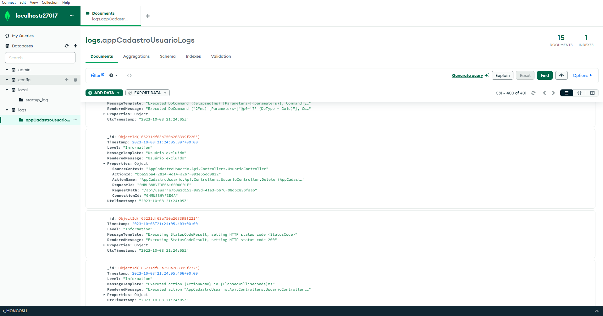
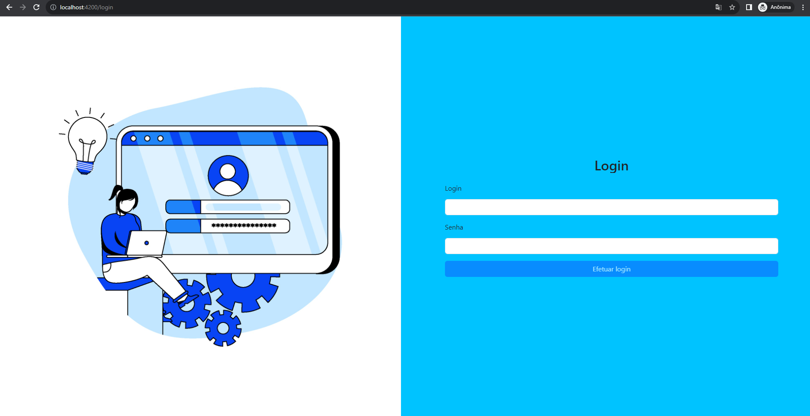

# Aplicação para Gerenciamento de Usuário!

Essa aplicação foi desenvolvida com o intuito de aplicar algumas tecnologias requeridas por um processo seletivo para desenvolvedor fullstack.

- Integração SPA UI Angular com Web Api .Net 6;
- Integração com ferramenta de ORM nesse caso utilizamos o Entity Framework Core;
- Integração SeriLog com MongoDB para registro das alterações e erros ocorridos na aplicação;
- Implementação de autenticação JWT 

Além disso foi desenvolvido uma tela para gerenciamento de usuários com possibilidade de inclusão, edição , exclusão e filtro. Também foi desenvolvido uma tela para realização de Login.

